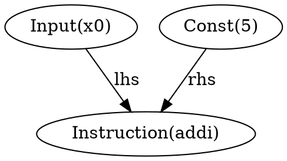
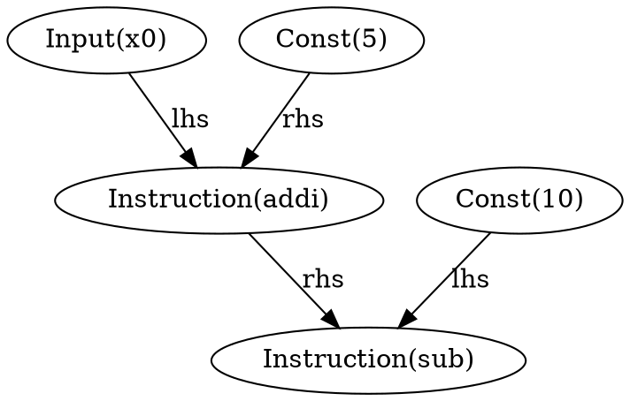
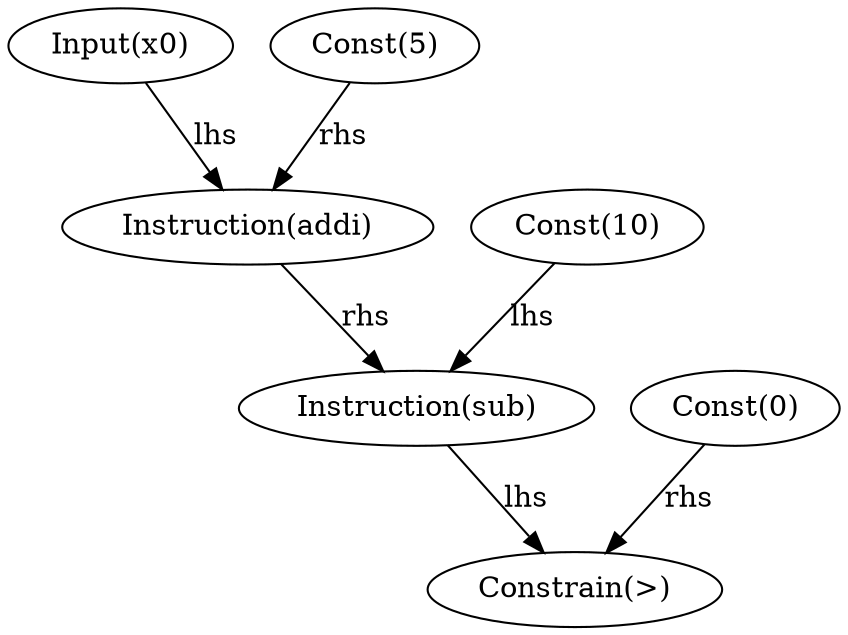
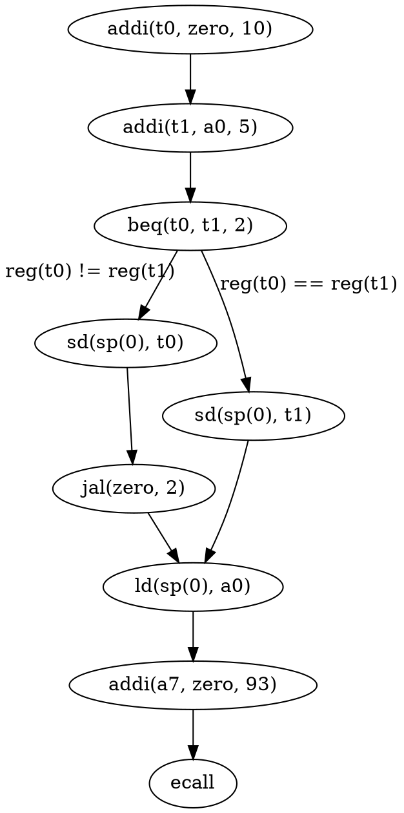
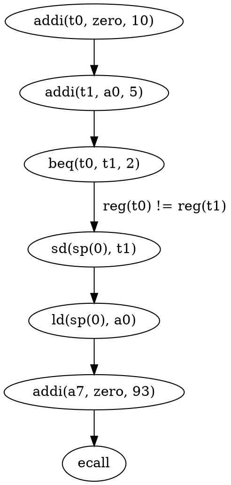
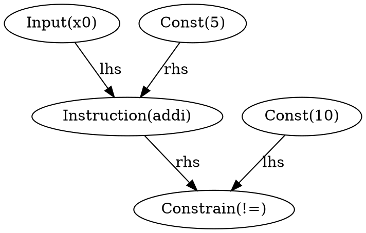
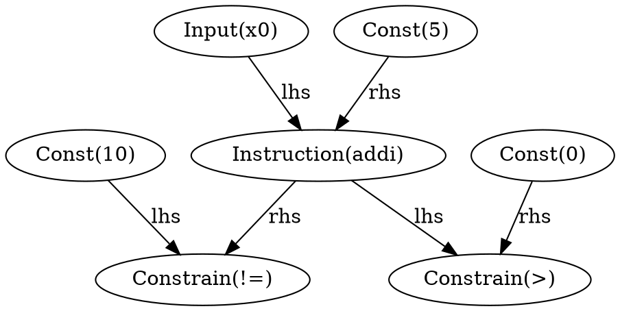

# Prototype Concept

Monster is a Symbolic Execution Engine for RISC-U binary code.
Given a RISC-U binary and any pointer into the binary, 
Monster can compute (with a high probability) a concrete input, 
where the program would reach that point.
On top of that Monster can also compute (with a high success probability)
a input for a constrained memory location at a specific point in the binary.


## Machine Model

In order to describe the engine, the following example of C* code will be used:

Pseudocode:
```C
uint64_t input = ?;

uint64_t x1 = input + 5;
uint64_t x2 = 10;
uint64_t x3 = x2 - x1;

exit(x3);
```

RISC-U:
```
addi t0, zero, 10
addi t1, a0, 5
sub t1, t1, t0
addi a0, t1, 0
addi a7, zero, 93
ecall
```

Now this code should be evaluated partially, where we differentiate between _Concrete_ and _Symbolic values_. 
Concrete values are of type unsigned 64-bit integer, whereas symbolic values only consist of a name (e.g. x0) for a SMT formula stored somewhere else.
We will also use a _Uninitialized_ value to model memory cells, which have not been initialized yet.
Now we need to model the state of the machine to be able execute instructions for it.
Keep in mind, that we defined, that our input is in register a0 and therefore this register has to contain already an symbolic value.

<table>
<tr><th>Registers</th><th>Memory</th><th>Formula</th></tr>
<tr><td>

| reg  | value          |
|------|----------------|
| zero | Concrete(0)    |
| a0   | Symbolic(x0)   |

</td><td>

| addr | value          |
|------|----------------|
|  -   |  -             |

</td><td> 

| label | formula       |
|-------|---------------|
| x0    | ?             |


</td></tr> </table>

Every memory cell or register, which is not explicitly mentioned here is _Uninitialized_.
Now the initial state of the machine is defined and we can start executing.

### Symbolic Execution

Given the first instruction `addi t0, a0, 5`, the symbolic value in register a0 has to be added with a concrete value 5 and the result has to be stored in t0.
For that we introduce a new label and store the formula 


`addi t0, zero, 10`:

<table>
<tr><th>Registers</th><th>Formula</th></tr>
<tr><td>

| reg  | value          |
|------|----------------|
| zero | Concrete(0)    |
| a0   | Symbolic(x0)   |
| **t1**   | **Concrete(10)**   |

</td><td> 

| label | formula       |
|-------|---------------|
| x0    | ?             |


</td></tr> </table>

`addi t1, a0, 5`:

<table>
<tr><th>Registers</th><th>Formula</th></tr>
<tr><td>

| reg    | value            |
|--------|------------------|
| zero   | Concrete(0)      |
| a0     | Symbolic(x0)     |
| t0     | Concrete(10)     | 
| **t1** | **Symbolic(x1)** |

</td><td>

| label | formula       |
|-------|---------------|
| x0    | ?             |
| **x1**    | **x0 + 5**        |


</td></tr> </table>


`sub t1, t1, t0`:

<table>
<tr><th>Registers</th><th>Formula</th></tr>
<tr><td>

| reg  | value          |
|------|----------------|
| zero | Concrete(0)    |
| a0   | Symbolic(x0)   |
| t0   | Symbolic(x1)   |
| **t1**   | **Symbolic(x2)**   |

</td><td>

| label | formula       |
|-------|---------------|
| x0    | ?             |
| x1    | x0 + 5        |
| **x2**    | **10 - x1**       |


</td></tr> </table>


`addi a0, t1, 0`:

<table>
<tr><th>Registers</th><th>Formula</th></tr>
<tr><td>

| reg  | value          |
|------|----------------|
| zero | Concrete(0)    |
| **a0**   | **Symbolic(x2)**   |
| t0   | Symbolic(x1)   |
| t1   | Symbolic(x2)   |

</td><td>

| label | formula       |
|-------|---------------|
| x0    | ?             |
| x1    | x0 + 5        |
| x2    | 10 - x1       |


</td></tr> </table>


`addi a7, zero, 93`:

<table>
<tr><th>Registers</th><th>Formula</th></tr>
<tr><td>

| reg  | value          |
|------|----------------|
| zero | Concrete(0)    |
| a0   | Symbolic(x2)   |
| **a7**   | **Concrete(93)**   |
| t0   | Symbolic(x1)   |
| t1   | Symbolic(x2)   |

</td><td>

| label | formula       |
|-------|---------------|
| x0    | ?             |
| x1    | x0 + 5        |
| x2    | 10 - x1       |


</td></tr> </table>

`ecall`:

<table>
<tr><th>Registers</th><th>Formula</th></tr>
<tr><td>

| reg  | value          |
|------|----------------|
| zero | Concrete(0)    |
| a0   | Symbolic(x0)   |
| t0   | Symbolic(x1)   |
| t1   | Concrete(10)   |
| a7   | Concrete(93)   |

</td><td>


| label | formula       |
|-------|---------------|
| x0    | ?             |
| x1    | x0 + 5        |
| x2    | 10 - x1       |


</td></tr> </table>


After the exit ecall we have to decide, how the query to the SMT solver will look like.
In this case an `exit_code > 0` is interesting for us, because that is an error condition for a program.
The `exit_code` at this point should be in register a0.
Now that the constrain is defined and we now formula (x2), the SMT formula can be written down as following:
`x1 = x0 + 5 and x2 = 10 - x1 and x2 > 0`

We can now write SMT-lib down for this formula which would look like this:

```
(set-option :produce-models true)
(set-option :incremental true)
(set-logic QF_BV)

(declare-fun x0 () (_ BitVec 64))      ; symbolic input x0 has no constrains (assert)

(declare-fun x1 () (_ BitVec 64))
(assert (= x1 (bvadd x0 (_ bv5 64))))  ; x1 = x0 + 5

(declare-fun x2 () (_ BitVec 64))
(assert (= x2 (bvsub (_ bv10 64) x1))) ; x2 = 10 - x1

(assert (bvugt x2 (_ bv0 64)))         ; x2 > 0

(check-sat)
(get-model)

(exit)
```

Of course that is a very explicit representation of this formula. 
Someone could easily rewrite that to the following formula and therefore omit many symbolic temporaries:

`10 - (x0 + 5) > 0`

And for that reason, we do not use that tabular approach to represent the formula, but use a graph for that. 
To be precise, we are using a data flow graph.


## Data Flow Graph

Using the example from before, we can show all the intermediate graphs during program execution:

```
addi t0, zero, 10
addi t1, a0, 5
```



```
sub t1, t1, t0
```



```
addi a0, t1, 0
addi a7, zero, 93
ecall
```



With this graph as result, an SMT formula can trivially be constructed by building an formula for every "Constrain" node. 
An algorithm could start at a constrain and track all it's input edges to build the formula.
This gives us a way more concise SMT formula:

```
(set-option :produce-models true)
(set-option :incremental true)
(set-logic QF_BV)

(declare-fun x0 () (_ BitVec 64))      
(assert (bvugt (bvsub (_ bv10 64) (bvadd x0 (_ bv5 64))) (_ bv0 64)))
; 10 - (x0 + 5) > 0

(check-sat)
(get-model)

(exit)
```


## Control Flow

Up until now, there was now control flow statement involved in our program. 
In this section, I will describe control flow in our symbolic execution engine.
Monster generates a so called Control Flow Graph, which encaptures all possible execution paths of a program in a graph.
Let's take a different example with non-trivial control flow:

Here is the C pseudo code of the program:
```C
uint64_t input = ?;
uint64_t x1 = input + 5;
uint64_t x2 = 10;

uint64_t exit_code;
if (x1 == x2)
  exit_code = x2;
else
  exit_code = x1;

exit(exit_code);
```

RISC-V
```
addi t0, zero, 10
addi t1, a0, 5
beq t0, t1, 2
sd sp(0), t0
jal zero, 2
sd sp(0), t1
ld sp(0), a0
addi a7, zero, 93
ecall
```

The control flow graph for this program looks like this:



It is a straight forward Control Flow Graph, where every node is a RISC-U instruction and an edge encodes an optional constrain when branch decisions are made.

### Candidate Path

With Monster we restrict our engine to execute one full path from program entry point to a specified exit point at a time.
This implies, that we have to generate so called candidate paths, which are execute symbolically.
Candidate paths are the result of computing all shortest paths in of the control flow graph.

So for our example the first candidate path to be executed is:



At this point, this path can be executed symbolically simialarly to the first example.
The only difference is, that we have encoded an additional constrain (`reg(t0) == reg(t1)`) at one point in the path.

### Conditional Symbolic Branching

So let's execute it symbolically and inspect the system state.

```
addi t0, a0, 5
addi t1, zero, 10
beq t0, t1, 2
```

<table>
<tr><th>Registers</th></tr>
<tr><td>

| reg  | value          |
|------|----------------|
| zero | Concrete(0)    |
| a0   | Symbolic(x0)   |
| t0   | Concrete(10)   |
| t1   | Symbolic(x1)   |


</td></tr> </table>



Execution of this path begins to differ when a `beq` instruction is reached.
For this instruction a constrain has to be modeled in the dataflow graph.
This constrain is part of the so called "path condition".
It reflects the decision made when branching.

After branching we have to symbolically execute a `sd` instruction.

## Memory Access

`sd sp(0), t0`

So far, I did not discuss the stack pointer at all, but the stack pointer in this case is clearly needed to calculate the address of the memory access.
A big question here is, what kind of value (symbolic/concrete) the stack pointer has.
For a concrete stack pointer value, the instruction has the same semantics as in normal execution.
In Monster we initialize the stack pointer with a concrete value depending on the memory size.
Also in RISC-U programs, if the stack pointer is intialized with a concrete value, it always stays concrete by construction (Selfie cstar).


**Monster can not handle symbolic addresses for a memory access!**

So for this example, `sd` and `ld` have the exact same semantics as in normal execution.
This gives us the following end result:

```
jal zero, 2
ld sp(0), a0
addi a7, zero, 93
ecall
```


<table>
<tr><th>Registers</th><th>Memory</th></tr>
<tr><td>

| reg  | value          |
|------|----------------|
| zero | Concrete(0)    |
| sp   | Concrete(248)  | 
| a0   | Symbolic(x1)   |
| t0   | Concrete(10)   |
| t1   | Symbolic(x1)   |
| a7   | Concrete(93)   |


</td><td>

</td><td>

| addr | value          |
|------|----------------|
| 248  | Symbolic(x1)   |


</td></tr> </table>




Now that this results in 2 constrains, SMT-lib looks kind of different for this graph.
2 assertions have to be made.
One comes from the path condition (`reg(t0) != reg(t1)`) and one is our output constrain (`reg(a0) > 0`).

```
(set-option :produce-models true)
(set-option :incremental true)
(set-logic QF_BV)

(declare-fun x0 () (_ BitVec 64))      ; symbolic input x0 has no constrains (assert)

(assert (not (= (bvadd x0 (_ bv5 64)) (_ bv10 64)))) ; path constrain

(assert (bvugt (bvadd x0 (_ bv5 64)) (_ bv0 64))) ; output constrain

(check-sat)
(get-model)

(exit)
```
